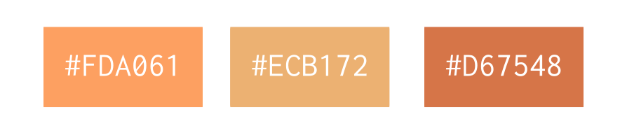

Style and Colors
================

Logos for Dask are available at :doc:`logos`.

For colors we typically choose from somewhere within the palette defined by the
Dask logo itself, which has an orange gradient.  In particular, we commonly
choose the following colors:

