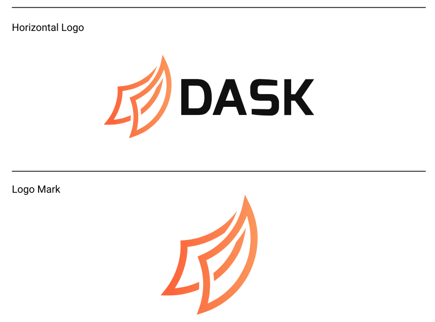
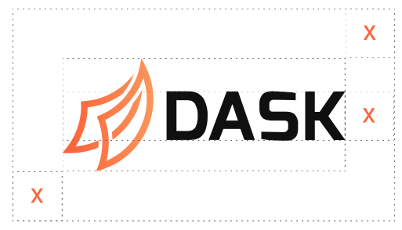
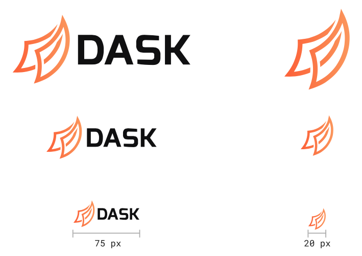
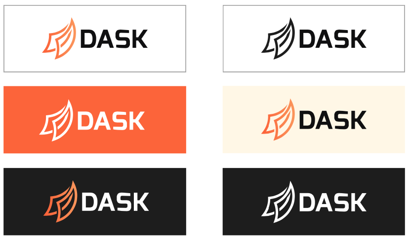
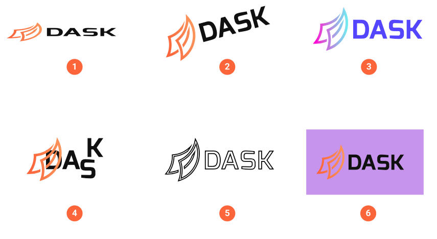
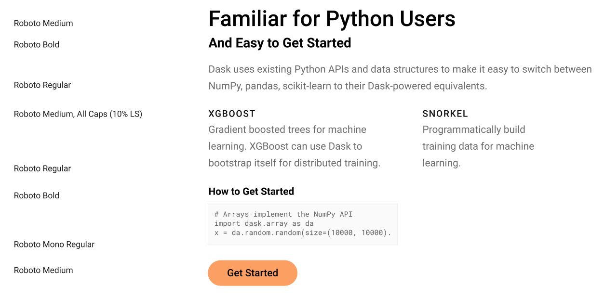
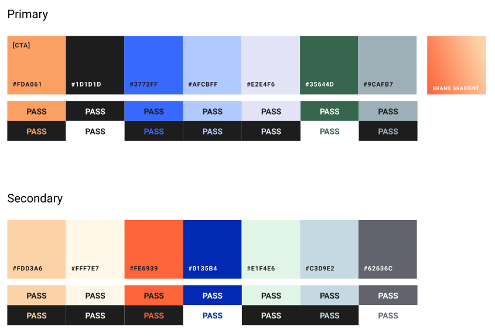

Style and Colors
================

These are guidelines for using the Dask logo with community-approved color palettes
and typography.

Logos
-----
Logos for Dask are available at :doc:`logos`. The Dask logo is made up of two components:
The Logo Mark and the Word Mark, which make up the Horizontal Logo:

Using the Logo Mark alone should be reserved for instances where the Horizontal Logo is already
present, or as an avatar when “Dask” appears alongside the Logo Mark in plain text.

In layout, make sure there is enough clearspace on all sides of the logo by using the x-height:

When resizing the Horizontal Logo or Logo Mark, the minimum widths should be 75 pixels (1-inch)
and 20 pixels, respectively, to ensure legibliity

There are a number of logo variations to ensure adequate conttrast with the background color

What *not* to do to the logo:
    1. Compress horizontally or vertically
    2. Rotate
    3. Recolor
    4. Disassemble
    5. Add strokes or outlines
    6. Place on an unapproved background color
   

Typography
----------
Roboto and Roboto Mono are the primary Dask typofaces. Roboto is best for
for H-level titles and longform body copy. Roboto Mono should be used when
displaying syntax/code snippets or as a labeling device for charts, graphics,
and specialty layout components.

Colors
------
For colors, we typically choose from the orange gradient on the Logo Mark
itself. You can use the following grid to select color for text,
graphical elements, and general layout. Note that text should meet a "Pass"
qualification to meet AA (or AAA) requirements.

   for the hex codes, text on a light background, and text on a dark background.

   Hex codes for primary palette (left to right): #FDA061, #1D1D1D, #3772FF, #AFCBFF,
   #E2E4F6, #35644D, #9CAFB7
   Hex codes for secondary palette (left ot right): #FDD3A6, #FFF7E7, #FE6939, #0135B4,
   #E1F4E6, #C3D9E2, #62636C
