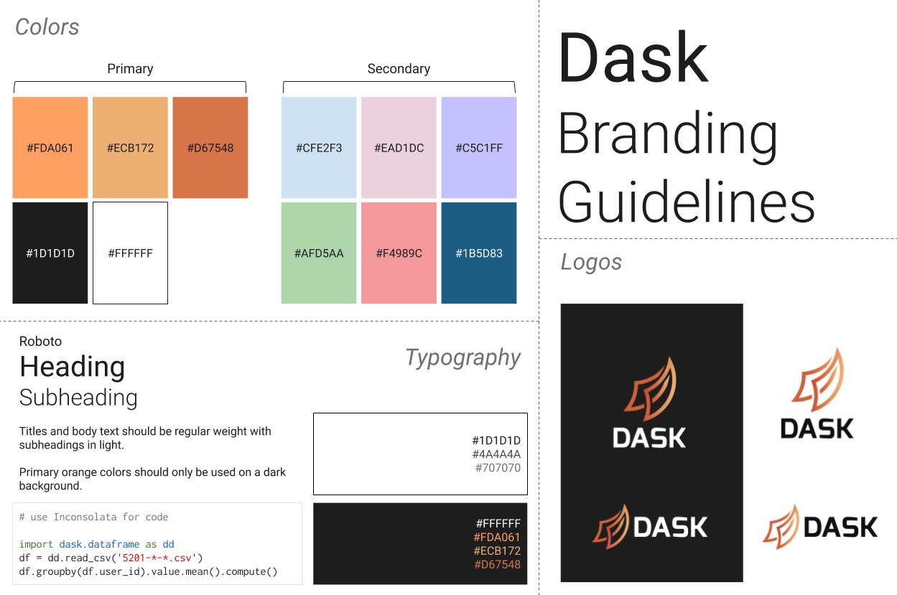

Style and Colors
================

Logos for Dask are available at :doc:`logos`.

For colors we typically choose from somewhere within the palette defined by the
Dask logo itself, which has an orange gradient.  In particular, we commonly
choose the following colors: #FDA061, #ECB172, and #D67548.

.. image:: images/dask-colors.svg
   :alt: Dask colors #FDA061 #ECB172 #D67548

For more involved diagrams we often choose from both primary colors and secondary
colors:

Typography
----------

Titles and body text should be regular weight with subheadings in light.

Primary orange colors should only be used on a dark background.

Fonts:

- Roboto (for headings and text)
- Inconsolata (for code blocks)

Font colors on light background:

- #1D1D1D
- #4A4A4A
- #707070

Font colours on dark background:

- #FFFFFF
- #FDA061
- #ECB172
- #D67548

Colors
------

Primary colors:

- #FDA061
- #EECD172
- #D67548
- #1D1D1D
- #FFFFFF

Secondary colors:

- #CFE2F3
- #EAD1DC
- #C5C1FF
- #AFD5AA
- #F4989C
- #1B5D83
